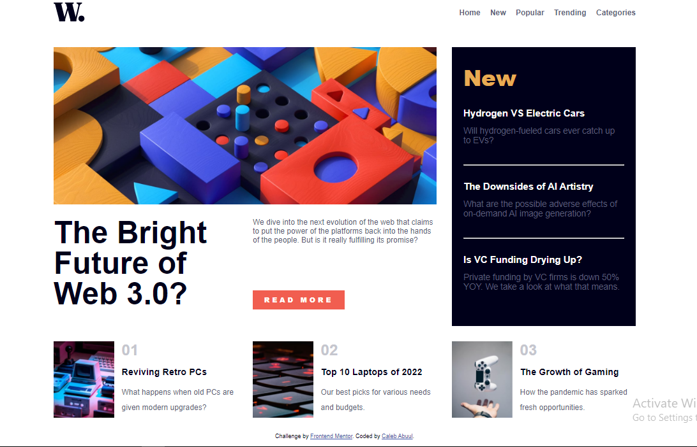

# Frontend Mentor - News homepage solution

This is a solution to the [News homepage challenge on Frontend Mentor](https://www.frontendmentor.io/challenges/news-homepage-H6SWTa1MFl). Frontend Mentor challenges help you improve your coding skills by building realistic projects.

## Table of contents

- [Overview](#overview)
  - [The challenge](#the-challenge)
  - [Screenshot](#screenshot)
  - [Links](#links)
- [My process](#my-process)
  - [Built with](#built-with)
  - [What I learned](#what-i-learned)
  - [Continued development](#continued-development)
- [Author](#author)
- [Acknowledgments](#acknowledgments)

## Overview

### The challenge

Users should be able to:

- View the optimal layout for the interface depending on their device's screen size
- See hover and focus states for all interactive elements on the page

### Screenshot



#### Desktop

### Links

- Solution URL: [Add solution URL here](https://your-solution-url.com)
- Live Site URL: [Add live site URL here](https://your-live-site-url.com)

## My process

### Built with

- Semantic HTML5 markup
- CSS custom properties
- Flexbox
- CSS Grid
- JavaScript

### What I learned

Following Kevin Powell's tutorials on YouTube, I learnt how to style grid layouts in a way that is both interesting and easy. I used to like flexbox, but now that I've learnt about Grid layout from Kevin, I'm all in for Grid.

To see how you can add code snippets, see below:

```html
<picture>
  <source media="(min-width: 1440px)" srcset="assets/images/pic1.jpg" />
  <source media="(max-width: 375px)" srcset="assets/images/pic2.jpg" />
  
</picture>
```

```css
:root {
  --primary-clr: hsl(0, 0%, 98%);
}
header {
  background-color: var(--primary-clr);
}
```

```js
const grabItem = (id) => {
  document.getElementById(id);
};
```

### Continued development

Going forward I would learn to use more Grid in my layout, because they are easier to manipulate and customize.

## Author

- Github - [Caleb Abuul](https://github.com/Caleb-Abuul)
- Website - [Caleb](https://https://caleb-abuul.github.io/caleb/)
- Frontend Mentor - [@Caleb-Abuul](https://www.frontendmentor.io/profile/Caleb-Abuul)
- Twitter - [@CalebAbuul](https://www.twitter.com/CalebAbuul)
- LinkedIn - [@Caleb Abuul](www.linedin.com/in/caleb-abuul)

## Acknowledgments

A big thank you to [Kevin Powell](https://github.com/kevin-powell). He has been a great inspiration through his [YouTube Channel](https://youtube.com/@KevinPowell?si=Yhw2-yrCyeetnmys). His solution for the [Frontend Mentor Manage-landin-page project](https://youtu.be/h3bTwCqX4ns?si=P3J2UdvHI3udbL7u) helped me got a hang of how to approach challenges on frontend mentor. He has tons of videos spanning several topics in CSS on YouTube. Please do well to check him out [Kevin Powell](https://youtube.com/@KevinPowell?si=Yhw2-yrCyeetnmys)
